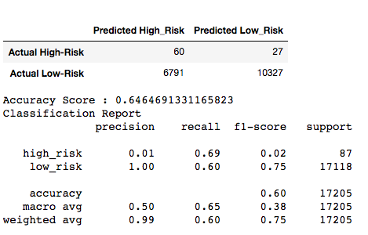
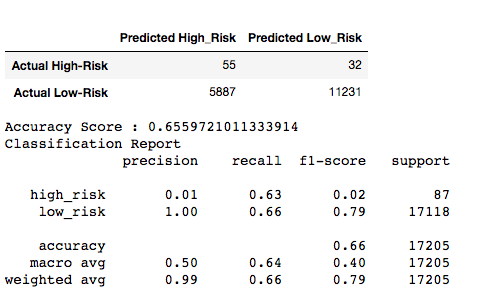
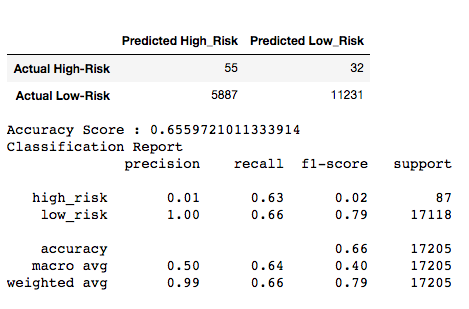
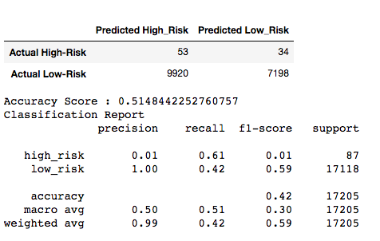
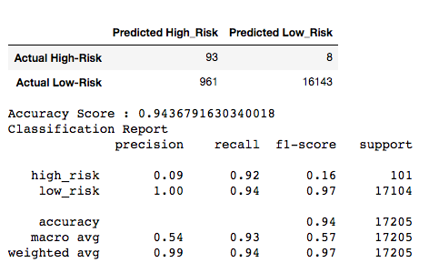

# Module 17 - Credit Risk Analysis

## Overview of Project
Using our new statistical reasoning and machine learning skills, we are to apply it to Credit Card risk analysis. In particular, to look into the risk of high risk investments which typically do not have as much data to back it up.

## Results

SMOTEENN:  

**SMOTE:**  

**RandomOverSample:**  

**ClusterCentroids:**  

**EasyEnsembleClassifier:**  

**BalancedRandomForestClassifier:**

## Summary

From the results shown above, it seems that using the EasyEnsembleClassifier model is the most effective, providing the highest score for risky loans. 
